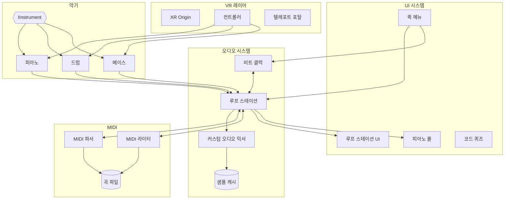

# 솔로 밴드 스튜디오 (Solo Band Studio)

**"혼자지만, 밴드입니다"**

[](https://unity.com/)
[](#크레딧--라이센스)
[](https://www.meta.com/quest/)

한국어 | [English](README.md)

> VR 환경에서 혼자서도 밴드처럼 음악을 만들고 연주할 수 있는 몰입형 음악 창작 플랫폼

<p align="center">
  
</p>

## 데모

[](https://youtu.be/NE7gBQYXINo)

> **참고:** 이 데모는 오픈소스화 이전에 녹화되었습니다. 영상에 나오는 일부 기능(야간 조명, 랜턴, 야외 환경)은 유료 에셋 제거로 인해 이 저장소에 포함되어 있지 않습니다.

## 주요 기능

| 기능 | 설명 |
|------|------|
| **악기** | 피아노 (88건반), 드럼 (풀 키트 + 스틱), 베이스 |
| **루프 스테이션** | 8트랙 녹음, BPM/박자 설정, 퀀타이즈, 메트로놈 |
| **피아노 롤** | 드래그 앤 드롭으로 노트 편집 |
| **MIDI** | .mid 파일 가져오기/내보내기, 클래식 10곡 내장 (퍼블릭 도메인) |
| **코드 퀴즈** | 귀로 코드 진행 학습 |
| **VR** | 핸드 트래킹, 이동 가능한 UI 패널, 햅틱 피드백 |

## 요구 사항

- **Unity 6.2** (6000.2.x)
- **VR 헤드셋**: Meta Quest 2/3/Pro (스탠드얼론 또는 PC VR)
- **패키지**:
  - XR Interaction Toolkit 3.2.2
  - OpenXR 1.16.0
  - Universal Render Pipeline (URP)

## 설치 방법

1. 저장소 클론
   ```bash
   git clone https://github.com/yourusername/solo-band-studio.git
   ```

2. Unity 6로 프로젝트 열기 (Unity Hub 권장)

3. 패키지 매니저에서 필요한 패키지 자동 설치 확인

4. `Assets/Scenes/TestRoom.unity` 씬 열기

5. Meta Quest로 빌드하거나 Quest Link로 에디터에서 실행

## 프로젝트 구조

```
Assets/
├── Scripts/           # C# 소스 코드
│   ├── Audio/         # 오디오 시스템, 루프 스테이션
│   ├── Core/          # 핵심 시스템
│   ├── Instruments/   # 피아노, 드럼, 베이스
│   ├── MIDI/          # MIDI 파서/라이터
│   ├── UI/            # UI 컨트롤러
│   └── XR/            # VR 인터랙션
├── Audio/             # 오디오 샘플
├── Prefabs/           # 악기 & UI 프리팹
├── Scenes/            # Unity 씬
├── UI/                # UXML/USS 파일
├── ThirdParty/        # 3D 모델 (Sketchfab)
└── StreamingAssets/Songs/  # MIDI 파일
```

## 아키텍처



## 조작 방법

| 동작 | Quest 컨트롤러 |
|------|---------------|
| 퀵 메뉴 열기 | Y 버튼 |
| 오브젝트 잡기 | 그립 버튼 |
| 피아노 건반 | 직접 터치 / 포크 |
| 드럼 타격 | 드럼스틱 휘두르기 |
| UI 조작 | 레이 포인터 + 트리거 |

## 크레딧 & 라이센스

이 프로젝트는 서드파티 에셋 (3D 모델, 오디오 샘플)을 사용합니다.

전체 저작자 표시 및 라이센스 정보는 [CREDITS.md](CREDITS.md)를 참조하세요.

> **참고**: 일부 에셋은 비상업적 라이센스 제한이 있습니다. 상업적 사용 전 CREDITS.md를 확인하세요.

## 문서

- [아키텍처](docs/architecture.md)

## 라이센스

이 프로젝트의 소스 코드는 교육 및 개인 사용 목적으로 이용 가능합니다. 서드파티 에셋은 [CREDITS.md](CREDITS.md)에 명시된 각자의 라이센스를 따릅니다.

