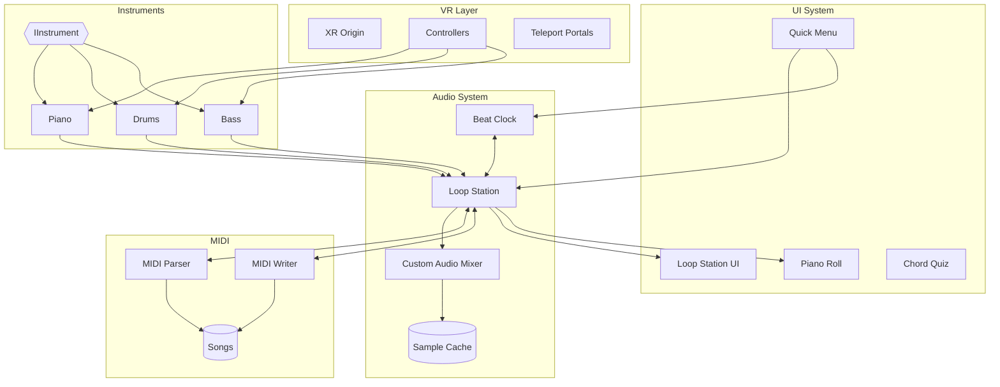

# Solo Band Studio

**"Alone, but a Band"**

[](https://unity.com/)
[](#credits--licenses)
[](https://www.meta.com/quest/)

[한국어](README.ko.md) | English

> An immersive VR music creation platform where you can play like a band, all by yourself.

<p align="center">
  
</p>

## Demo

[](https://youtube.com/watch?v=VIDEO_ID)

> **Note:** This demo was recorded before open-sourcing. Some features shown (night lighting, lanterns, outdoor environments) are not included in this repository due to removed paid assets.

## Features

| Feature | Description |
|---------|-------------|
| **Instruments** | Piano (88-key), Drums (full kit + sticks), Bass |
| **Loop Station** | 8-track recording, BPM/time signature, quantization, metronome |
| **Piano Roll** | Visual note editor with drag-and-drop editing |
| **MIDI** | Import/export .mid files, 10 classical songs (public domain) |
| **Chord Quiz** | Learn chord progressions by ear |
| **VR** | Hand tracking, grabbable UI panels, haptic feedback |

## Requirements

- **Unity 6.2** (6000.2.x)
- **VR Headset**: Meta Quest 2/3/Pro (standalone or PC VR)
- **Packages**:
  - XR Interaction Toolkit 3.2.2
  - OpenXR 1.16.0
  - Universal Render Pipeline (URP)

## Installation

1. Clone the repository
   ```bash
   git clone https://github.com/yourusername/solo-band-studio.git
   ```

2. Open with Unity 6 (Unity Hub recommended)

3. Import required packages via Package Manager if not auto-resolved

4. Open `Assets/Scenes/TestRoom.unity`

5. Build for Meta Quest or run in Editor with Quest Link

## Project Structure

```
Assets/
├── Scripts/           # C# source code
│   ├── Audio/         # Audio system, loop station
│   ├── Core/          # Core systems
│   ├── Instruments/   # Piano, drum, bass
│   ├── MIDI/          # MIDI parser/writer
│   ├── UI/            # UI controllers
│   └── XR/            # VR interactions
├── Audio/             # Audio samples
├── Prefabs/           # Instrument & UI prefabs
├── Scenes/            # Unity scenes
├── UI/                # UXML/USS files
├── ThirdParty/        # 3D models (Sketchfab)
└── StreamingAssets/Songs/  # MIDI files
```

## Architecture



## Controls

| Action | Quest Controller |
|--------|-----------------|
| Open Quick Menu | Y Button |
| Grab Objects | Grip |
| Piano Keys | Direct touch / Poke |
| Drum Hit | Swing drumstick |
| UI Interaction | Ray pointer + Trigger |

## Credits & Licenses

This project uses third-party assets (3D models, audio samples).

See [CREDITS.md](CREDITS.md) for full attribution and license details.

> **Note**: Some assets have non-commercial license restrictions. Check CREDITS.md before commercial use.

## Documentation

- [Architecture](docs/architecture.md)

## License

This project's source code is available for educational and personal use. Third-party assets have their own licenses as specified in [CREDITS.md](CREDITS.md).

