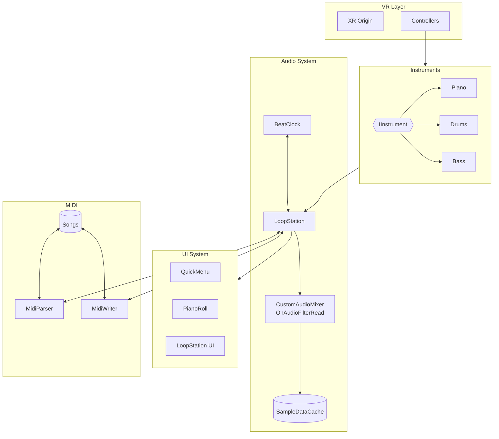
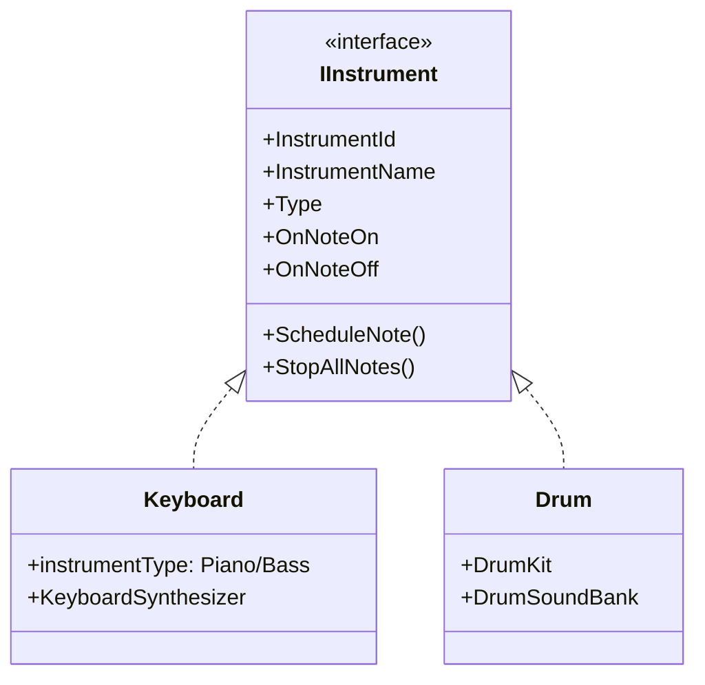
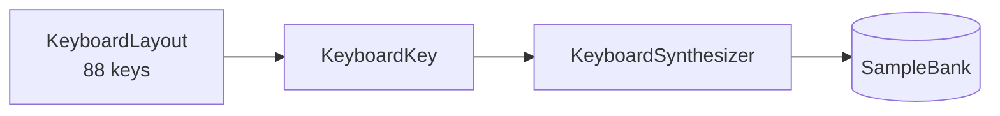
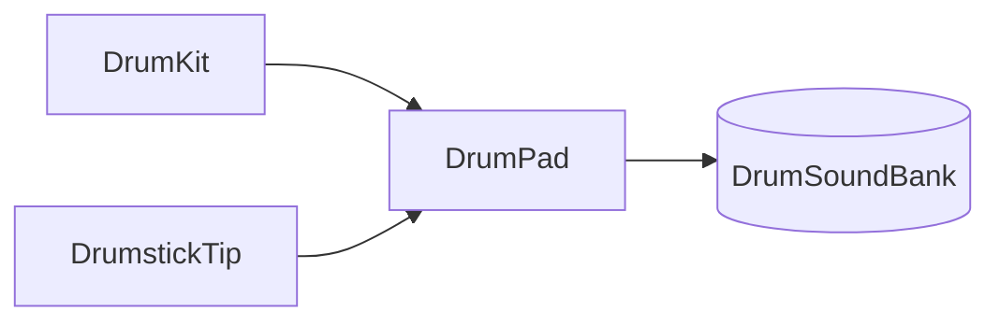
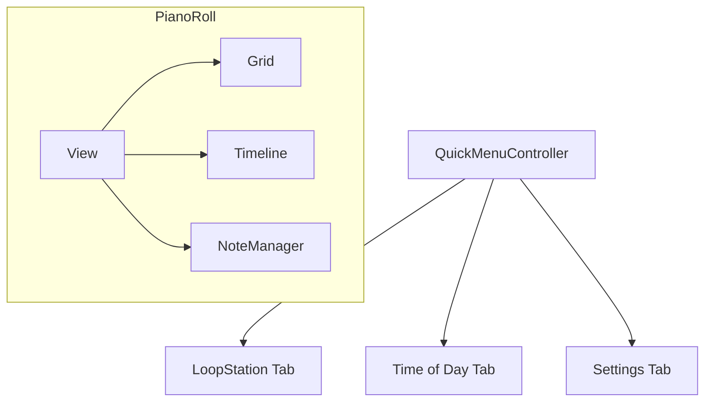
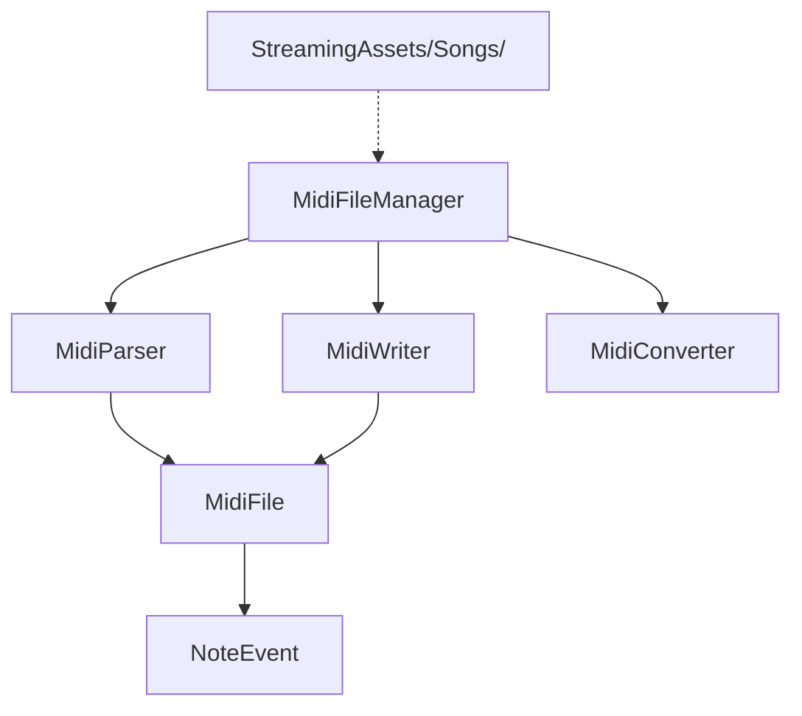
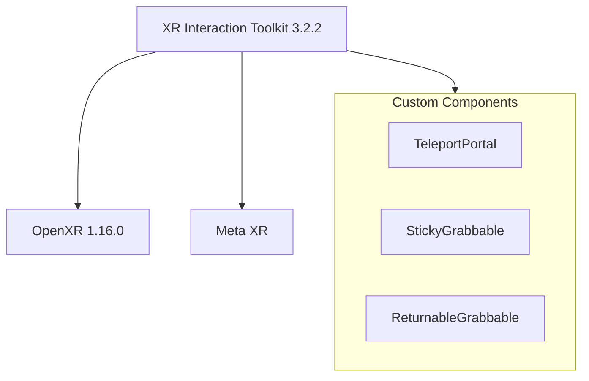

# Architecture

Technical documentation for Solo Band Studio.

## System Overview



## Instrument System

### Interface Design



### Keyboard System (Piano/Bass)

Both Piano and Bass use the same `Keyboard` component with different sample banks.



### Drum System



**DrumPad Types:** Kick, Snare, HiHatClosed, HiHatOpen, TomHigh, TomMid, TomLow, Crash, Ride

## Audio System

```mermaid
flowchart TB
    subgraph Mixer["CustomAudioMixer"]
        AFR[OnAudioFilterRead]
        VP[Voice Pool - 64 voices]
        CQ[ConcurrentQueue]
    end

    subgraph Cache["SampleDataCache"]
        SC[AudioClip → float[]]
    end

    subgraph Components["Components"]
        BC[BeatClock<br/>30-300 BPM]
        MET[Metronome]
        LS[LoopStation<br/>8 tracks]
    end

    CQ --> AFR
    SC --> AFR
    AFR --> VP
    Mixer --> Components
```

**Key Features:**
- Sample-accurate timing via `OnAudioFilterRead`
- Frame-rate independent scheduling
- Thread-safe communication with `ConcurrentQueue`
- Pre-cached audio samples for audio thread access

## UI System

Built with UI Toolkit (UXML/USS).



**UI Panels:**
| Panel | Features |
|-------|----------|
| QuickMenu | Y button toggle, spawns in front of user |
| LoopStation UI | Track controls, BPM, recording |
| PianoRoll UI | Note visualization, drag-and-drop editing |
| ChordQuiz UI | Interactive chord learning |

All panels have grab handles for repositioning in VR.

## MIDI System



- Standard MIDI file (.mid) support
- Auto-loads files from `StreamingAssets/Songs/`
- Import/export for loop recordings

## XR System



## Rendering

- Universal Render Pipeline (URP)
- Custom `ScreenFadeFeature` for scene transitions
- Day/night cycle system (`TODManager`)

## Feature Checklist

### Instruments
- [x] Piano - 88 keys with velocity
- [x] Drums - Full kit with drumstick collision
- [x] Bass - Keyboard-based with bass samples

### Loop Station
- [x] 8-track recording
- [x] BPM control (30-300)
- [x] Quantization (1/4, 1/8, 1/16)
- [x] Metronome (audio + visual)

### MIDI
- [x] Import/export .mid files
- [x] 10 classical songs (public domain)
- [x] Auto-load from StreamingAssets

### Piano Roll
- [x] Note visualization
- [x] Drag-and-drop editing
- [x] Timeline with playhead
- [x] Zoom/scroll

### VR
- [x] Hand tracking support
- [x] Teleport + continuous movement
- [x] Grabbable UI panels
- [x] Haptic feedback

### Audio
- [x] Sample-accurate DSP scheduling
- [x] 64-voice polyphony
- [x] 3D spatial audio
